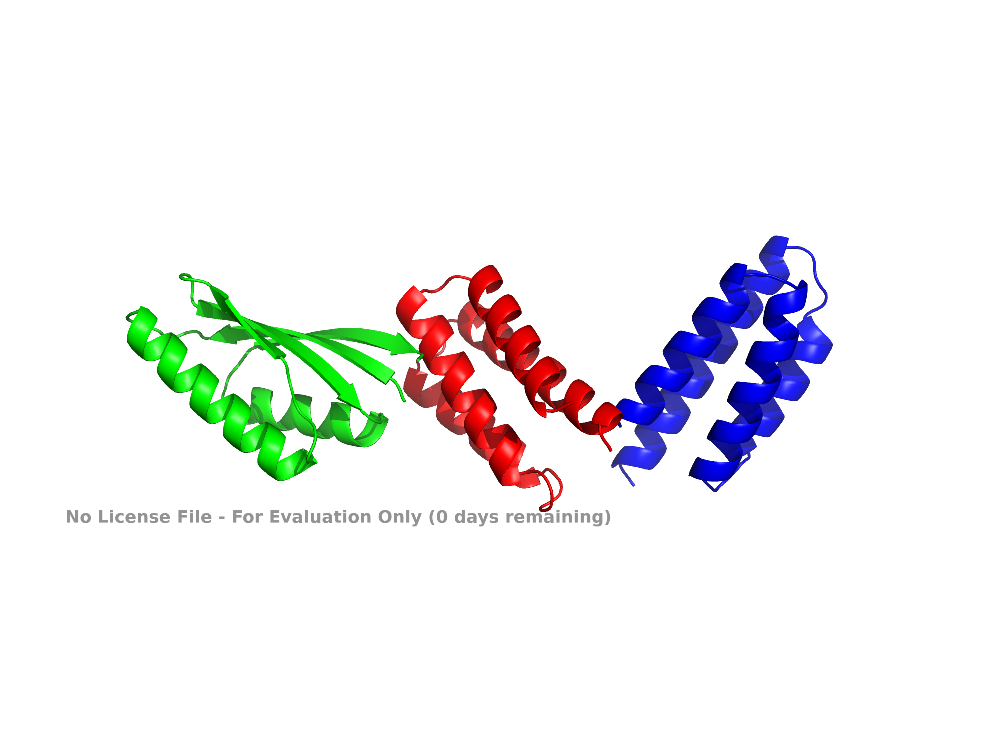

# RFdiffusion De Novo Monomer Pipeline

A minimalistic protein design project showing the first stage of de novo protein design: **AI-based backbone generation with RFdiffusion**, followed by **basic structural analysis, ranking, and candidate selection**.

## Project goal

This repository demonstrates a small but structured workflow for generating **de novo monomer protein backbones** using RFdiffusion and preparing them for downstream sequence design.

Instead of only running RFdiffusion once, this project aims to show a more realistic workflow:

1. generate multiple candidate backbones
2. collect the generated PDB files
3. extract simple structural features
4. rank and review candidates
5. prepare selected designs for the next stage of design

## Why this project matters

Modern protein design workflows often separate:

- **backbone generation**
- **sequence design**
- **structure validation**
- **experimental testing**

This repository focuses only on the **backbone generation stage**, which is where RFdiffusion fits.

That makes this a clean first project for understanding de novo protein design.

## Workflow

```text
RFdiffusion
   ↓
Generated backbone PDB files
   ↓
Feature extraction
   ↓
Candidate ranking
   ↓
Selection for downstream sequence design


## Current results

A first RFdiffusion test run was completed using unconditional monomer generation.

Run settings:
- target length: 80 residues
- number of generated designs: 5

Observed results:
- all 5 designs were parsed successfully
- all designs contained 1 chain and 80 CA atoms
- compactness was estimated using radius of gyration
- top 3 candidates were selected for downstream review

Top-ranked designs from the current run:

| rank | design_id | radius_of_gyration | selected |
|------|-----------|--------------------|----------|
| 1 | test_1 | 11.801738 | yes |
| 2 | test_2 | 11.833303 | yes |
| 3 | test_0 | 11.947165 | yes |
| 4 | test_4 | 12.417946 | no |
| 5 | test_3 | 13.061824 | no |


## Selected design gallery

Top compact backbone candidates generated using RFdiffusion (length = 80 residues).

- Red: test_1 (rank 1)
- Blue: test_2 (rank 2)
- Green: test_0 (rank 3)


